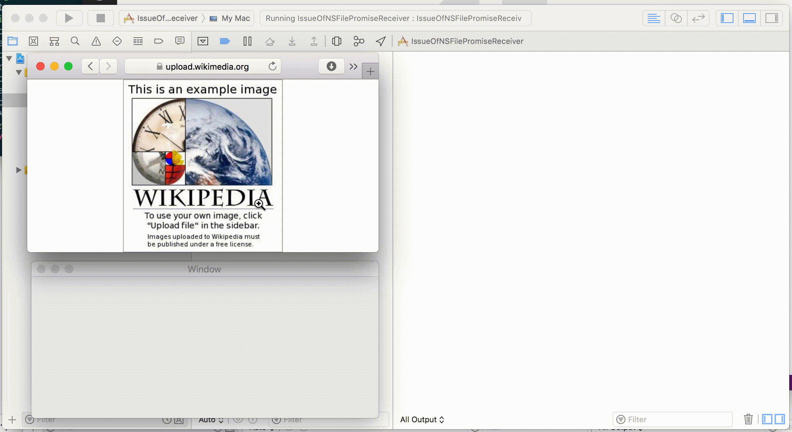
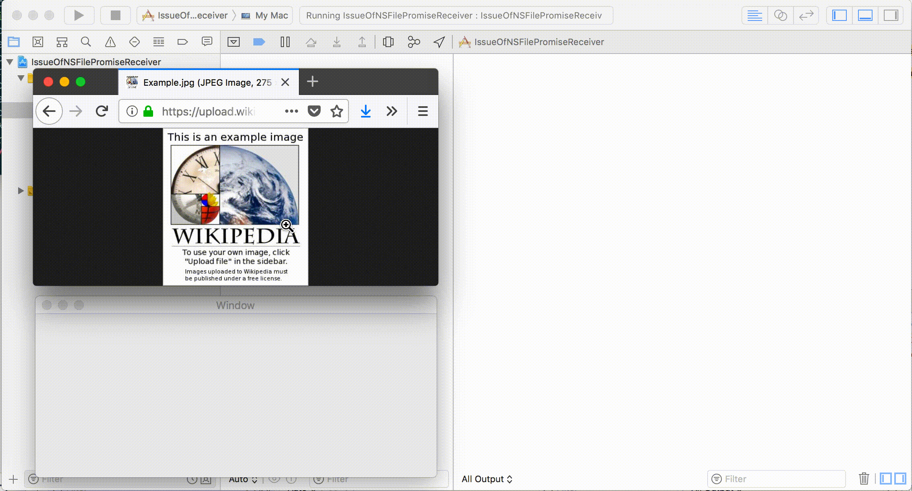

# IssueOfNSFilePromiseReceiver

This is a project to reproduce a issue of NSFilePromiseReceiver & Firefox.

## Problem

To get a dragged image from web browsers, I tried to get NSFilePromiseReceiver objects from NSPasteboard like this:

```swift
override func performDragOperation(_ sender: NSDraggingInfo) -> Bool {
    let objects = sender.draggingPasteboard()
        .readObjects(
            forClasses: [NSFilePromiseReceiver.self],
            options: nil)
    ...
}
```

But `objects` will be a empty array if the browser is Firefox.

This doesn't happens when using other browsers.

[See also the actual code](
IssueOfNSFilePromiseReceiver/ViewController.swift)

https://developer.apple.com/videos/play/wwdc2016/203?time=1454

## Repro

Image I used: <https://upload.wikimedia.org/wikipedia/en/a/a9/Example.jpg>.

### Safari

Result: Works fine. A NSFilePromiseReceiver object is created.



Output:

```
🔵 pasteboard.types: -----------------------------------
dyn.ah62d4rv4gu8yc6durvwwa3xmrvw1gkdusm1044pxqyuha2pxsvw0e55bsmwca7d3sbwu
Apple files promise pasteboard type
public.tiff
NeXT TIFF v4.0 pasteboard type
dyn.ah62d4rv4gu8zs3pcnzme2641rf4guzdmsv0gn64uqm10c6xenv61a3k
WebURLsWithTitlesPboardType
dyn.ah62d4rv4gu8yc6durvwwaznwmuuha2pxsvw0e55bsmwca7d3sbwu
Apple URL pasteboard type
public.url
CorePasteboardFlavorType 0x75726C20
public.url-name
CorePasteboardFlavorType 0x75726C6E
public.utf8-plain-text
NSStringPboardType
com.apple.flat-rtfd
NeXT RTFD pasteboard type
com.apple.webarchive
Apple Web Archive pasteboard type
dyn.ah62d4rv4gu8yc6durvwwaz5fqmf0w7baqv4045p3eb2gc65yqzvg82pwquuhk8puqy
Apple WebKit dummy pasteboard type
com.apple.pasteboard.promised-file-content-atype
com.apple.pasteboard.promised-file-url
dyn.ah62d4rv4gu8y6y4usm1044pxqzb085xyqz1hk64uqm10c6xenv61a3k
NSPromiseContentsPboardType

🔵 objects: -----------------------------------
[<NSFilePromiseReceiver: 0x6040000a8dc0>]
```

`[<NSFilePromiseReceiver: 0x6040000a8dc0>]` is what I want.

### Firefox



Output:

```
🔵 pasteboard.types: -----------------------------------
com.apple.pasteboard.promised-file-url
dyn.ah62d4rv4gu8y6y4usm1044pxqzb085xyqz1hk64uqm10c6xenv61a3k
NSPromiseContentsPboardType
public.utf8-plain-text
NSStringPboardType
com.apple.pasteboard.promised-file-content-type
dyn.ah62d4rv4gu8yc6durvwwa3xmrvw1gkdusm1044pxqyuha2pxsvw0e55bsmwca7d3sbwu
Apple files promise pasteboard type
public.url-name
CorePasteboardFlavorType 0x75726C6E
public.tiff
NeXT TIFF v4.0 pasteboard type
public.html
Apple HTML pasteboard type
dyn.ah62d4rv4gu8zs3pcnzme2641rf4guzdmsv0gn64uqm10c6xenv61a3k
WebURLsWithTitlesPboardType
public.url
CorePasteboardFlavorType 0x75726C20
dyn.ah62d4rv4gu8yc6durvwwaznwmuuha2pxsvw0e55bsmwca7d3sbwu
Apple URL pasteboard type
org.mozilla.custom-clipdata
org.mozilla.MozillaWildcard

🔵 objects: -----------------------------------
[]
```

No `[<NSFilePromiseReceiver: ...>]`. Just `[]`...

I also tried other browsers (Chrome and Sleipnir). But this problem didn't heppen.
